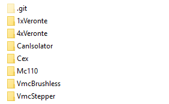

# PDI Templates

### Introduction

PDI Templates the way our clients keep partial or full for their vehicles stored in a remote repository. 

**Follow this handbook to upload your configurations.**

-----

## Upload a configuration

This guide is divided in steps, follow all the steps to successfully upload a configuration.

 1. <a href="https://docs.github.com/en/github/creating-cloning-and-archiving-repositories/cloning-a-repository-from-github/cloning-a-repository">Clone this repository</a>

 2. Add a configuration:
    
    - Copy your configuration folder in the correspondant product folder. See the image below.

        


    - Add an `info.json` with data about your configuration folder root. You can copy the file from any other config and edit it or create your own from scatch following the structure below.

       ```json
      {
      "searchTags": [
        "Full", // if this is a full configuration this tag is mandatory
        "Octocopter",
        "RL8V39"
      ],
      "description": "This is a configuration for the Octocopter RL8V39", 
      //the image must be converted to a base64 string in order to be used
	  "image" : "/9j/4AAQSkZJRgABAQAAAQABAAD/2wCEAAoHCBYWFRgWFRYYGRgaHBgYHBwZGhgZHhUYGBoaGhwaGBwcIS4nHB8rHxkYJjgmLC8xNTY1HCQ7QDszPzY0NTEBDAwMEA8QHxISHzQsJCs0NDU7PTQ/NDQ9Pz09NjQ1NDU0PzQ9MT80NDE0NDE/NDQ9NjQ9OzQ0NDQ0NDQ0NTExNP/AABEIAKgBLAMBIgACEQEDEQH/xAAcAAEAAQUBAQAAAAAAAAAAAAAABwIDBAUGCAH/xABAEAACAQIEAwUGBAUCBAcAAAABAgADEQQSITEFQVEGEyJhcQcyUoGRoRRCYsFysdHh8DOSgqLD8RUjJENTstL/xAAYAQEBAQEBAAAAAAAAAAAAAAAAAQMCBP/EACQRAQEAAgICAAYDAAAAAAAAAAABAhEDIRIxBCJBUZGhE2GB/9oADAMBAAIRAxEAPwCZoiICIiAiIgIiICIiAiJr8dxihR/1a1NPJnUE+gvcwNhE4zG+0XBp7neVT+hMo+ZfL9gZo6/tOqE/+Xh0C/rdmJHyAt94EnxOU4H24w1eyse5qH8rkZSf0vsfnY+U6uAiIgIiICIiAiIgIiICIiAiIgIiICIiAiIgIiICIiAiJzHEe3WAokhsQrMCQVphqmo3BKAqD6kQOniRnjvaug0oYZ286jqnzsua/wBROdxntEx1U2QpT8qaXa3q+b7WgTaTNLj+1ODo3FTEUwRuqtnYf8K3P2kIYzFYmvfvqrvzy1HNiB8KE2+gmM2HRVBL6kGwynW3n5/aBKuO9p+GW4pU6lQ9SBTU/M3b/lnO432mYprimlOmPQ1GHzNh/wAs4vDVUB8SAjbc6X5jlcTOxIpsoCZyRoCq2U9SdtfTygZWM41ja3+pWqkcwGyLY9USw+019PC5iQrAkb6MPqSP5z7QpMh1dUvyY335262/n5yhnQXJLOx1OuVSb6+ZgVUXS1mAGm92JJ8uQ/l6SrvUUkKC4PNtLegH9Za/FW9xVUemY/Uy1Auhpv8AgXarEYawV81Mfke7Lb9PNPkbeRnP5CAGsbHQG2h9DPoMCYeD9vMNVsKhNFv16pfycaAfxWnVJUDAEEEHUEG4I8iJ54Vps+G8YrUDejUZOoBup9VOh+kCeIkecI9og0XEpb9dPb5odfoT6Tt8BxClXXNSdXX9J28mG4PkYGZERAREQEREBERAREQEREBERAREQEREBERATzf2lwvd4rEIBbLVqafpzkqf9pE9ISCPaXQycQrfrFN/S6Kp+6EwOUUzNwuNZBlu2XU2UhTe2mttr2+8wPSVq8DYVcdc3VFU666s2u+rTHqVmb3jpcm3IE72HKWA0+3gZVHEZdkW/Ugn7Xt/2Epeuzbk8vLbbaWAZn4DDK4Kkqp3zEtdVFr6e7bXmYGMoJ2ErFM6agXBI13ty02PkZm1DTRnBqFrqLGkMuvRgPCfrLS48Kboig2y3N/ELc1By3+0CujgSSAVJJHukimQegvckedhLyUUTVqiBlvbJmLE6gh9NPpMIVqlQhczMWNgL7k7aTa4nA4akFV2dntqEIOv009N4GKcdTX3Kfi5s5J330vv5ggzHfEM9sxvbYnf0vuZs6HCFe+VKqaaGoyAX8xlv9jNXiaDIxRxYj56crHnAAysNLAaVXgXu8l7CY56bh6bsjjmpIPoeo8jpMMtPmaBI3BPaOwsuKTMPjQAN6smx9Rb0ne8N4pRxCZqLq687br5Mp1U+RE89l7c/pr/AGnUezamz45CCQER2axOq5coBtyzOp+UomuIiQIiICIiAiIgIiICIiAiIgIiICIiAkOe2TDZcTRqD89Ip6925P8A1BJjkbe2fD3oYep8NRk+VRC3/TECIs0rcW1+ssk6/wCby9fSRX1TKhMdHsbS+JUVCfZ8E+wPt5VKJVAuU6hU3UkHUXG+vnNlgONPTtdVcAWBYWZR0DdPKaqfbQOjPaNb5hSIbn49G/iGXWafG4tqrl3tc2FhoABsBMR3C+8QPLn9BrLP4tfygn10+w/rLoZg8pQ7hdz8tz9Bt87TEfFnYnToNB8+vzlAcGNC5Ux4BsF+bfsB+95ewZaq6U0Vnd2Cqq9T0Gw/YXM1uJpaEib7sfWrUFWuiHVmGa2pRbArf1B08hvM+XPxx27wx8stPvEuGVcO+SqhQ8r2IYdVYaMPQyQvZDgtK9Y8ylNfkM7f/ZPpLpqYXiaKr+CoL5WDZSpOp0O97bEcp03Y7hq4bD9yrq7K752X4i1wCLmxyZR8pzxc2Oc69meFxvboYiJq4IiICIiAiIgIiICIiAiIgIiICIiAnHe1PDZ+HVSBco1Nx5WqKrH/AGs07GartPhe9weJpjd6NRR/EUNvvaB5rMqQ6S2rXEqQ6f5tIq28uUK3Iy08tMYRtBAmJQxQGjm3nqfraXHxaja5+wlGSDDsB7xA9f6TWVMY3Ww8v6y9gKBqnKoZm6KCTr6SWyTdWTa4+OUbAn10ExauOc87Doun95k8c4PUw2UVMoLX8IYFkOhs6/luDcdddppWeJlLNwss9skVJ0PB+AO9mqEonw/mb1+ETD4NgwhDvq3Ick/vOop8QVBcnU7AWu3pf+Z0E62jYUeHU6Y8FEeobxfVv6zDx2LCkB6T26MLg+mk3PDrEB6xyqdVQXBYDyFmb1uo8m3mW/H6SeClRU+iakdbJl+us039Ks47e9dff1EZccID50ptTQ/lbr1A3AnTdhOG4zEU6oSr3VPRlVgSKr35LqQugu9ug11tmcTp0sSrq1I0mYEBgjKuY7Flbne2osf5TDw+DbDPmp1gxUA50bMFFstnUaoNCP5gTyfEZeM9fmNOPHd9/irmFxw79abpkq95kJQnKzjMiaXuPE3mPKTPwrBd1TVCQSALkCwNugnDcJxGHxLpVq0mavRYNmVQCxTqdntvr0uLXCmR5zwzC/NJ2vJcp1X2IiehiREQEREBERAREQEREBERAREQEREBKSLyqIHljHYfuqlSn/8AG7p/scr+0to0kn2s9jipbHYdfCTeug/KT/7oHQ/m8/F8RkXU3kFxzLTGVMZQTAtVtpeG0s1NpfB0lFitO67D4M00WsNc3iFjpZWIsbcwQSRyuvMTg6pmz7P43EhxSw/iLsCFIuMx8N9SAARoT5DoJh8Rhc8LJdNuHKY5bsTJxnh9DiVLJU8NW1ldbZgdLAjmLkaHrpa8iHG9nqmFrtTrZSyHwkG6sDqGH9ORvO5o8WUNkFhWQuCFzeJkBFkDKGYeJmta/hMwOL1kcBGcvUuWcs+bKddBf3TY6jyHSef4XLPH5cu2vNhjrccm2Jya/QdTM3AOVOd7M+4B91ByJ/Yf3M1YOZywFxey+fQ/Pf8A7S8738IPhB8R+Nv/AMj+093dup7Y4Y46uWXqfu/Zuk4q7ZsjGzDxObAso8/yp/gGxm9wFKyAknxEWJBu5O2VNSb9Wux6Aazl+FqGIZvcBBUHn0duv6R851+BqNVBUCye4W1/Ppqw1ub8v5XM18phOvz9Wedy5Lu/5J6i7Tw5bYA87s2gH8KGw+ZI9JTicBScgrVRKo/Ogym/6gGIYTYHgyMgRxcajIamS1iB7qH4ddSTqusjrtp2cXCFKlHMqsWUqTdqTrY2DaEqRex/SdxYzL+XHO6PG49pW9nmAdnrtWUXR1ylbhXZ1uzFRodAh+fkJIcjv2MY01MEwYksrm7MSSxbqT6SRJJjMfRbb7fYiJ0hERAREQEREBERAREQEREBERAREQEREC3UQMCrAEEEEEXBB0II5iefPaH2QOBrB6YP4eqTk59225pE+lyp5gHoSfQ81nHuE08VQehVHhcWuLXVhqrL+oGxHpA8vOZbvM3jHD3w9epQqe9TYqejc1YeTKVYeTCYUg+PsZcQ6S02xlStoJRTWW403na8CwoTD0i2l/GHXkWY2BYfmAC6cr+c4wiXsPiHTVGI1Btc5SR8S7GZc3Hc8dS6acWfhd6SLxngK41SSVWuqhg9wFrgaAPewD7jNsfWR1i8K9IlGupvkIIIP35EfznU4HtBTdFViEdNQWYLlzZg5VmOugUDdvE2nOc/2lxyVqimkuVFGUb+K272OouSTb95lweePy5Rpy+Nm8appsVTTc+EepF2PyH7ynLmIQe7ufTkPmdPrLRfVB0Un5sZf4frmbqbfTQfv9Z6p6392fJe5j9JP3XQ8GwRrOqXstxmYeegA8zsOgkgYLCKiqoUKGU0yBnUZ1OmpN7E6aC7XJ2EwOz3DhTpKpuDUtnOYJmLrnuOZyqLW8z6zbptnOisEdipAAYmxILeL3bDloRbfTz55bv9OscdQaxUklbEMfcyFHUK1ybHKS1m1193TecH7UsQD3VH8xZqjajQKqop011OfU6+Gdzj8YtFGqVGKBM13Firatuo2JYDTf3RckmRZhlq47EvWFN3sCy00UsQie6qgc+vUk9ZePHvaZ3rTbdhu1jcOY0iO8ptZqi6B0YjQodtFt4ToSdxJ04VxGniKSVqLZkcXB22JBBB2IIII5EGedjgMVXrWOHr59EVe5cFEB0UnKBYdTJ27E8GbCYOnRc3fxM3kzsWtp0BA+U3ZOhiIgIiICIiAiIgIiICIiAiIgIiICIiAiIgIiIEW+2Hst3lMY2kPHSULVA/NSBJDW6qSb/pJ+ESF563dQQQQCDoQdbg8jPO/tG7JHA4jNTB/DVSSh5U23akT5br1XrYwOPbaVIdJQYQ6QKi8o74c5bqvMnC8OZ0Z1K+A+MMQtgQSGF9xYHbXTzFwtugO0Uwf8/ebr/wG9NBSL1KzflVcwa4uFVQM1x1O99gNZ2PZv2Q16lmxr9yvwIVaoR5tqq8vi+UCOqwOh8sp+tx8pm8MIUZm2Uu5/4RPQ/DuxmBo0zSTDUyp94uoqM/8TPcnc+QvpaRf2u7BvhWZqWZsM9xf3npZxlyt1HRudrHWxYtu7t0uAxSVER0YBXyOjgC17BGVra3B0IJButrWEY7idKgveVHRAbare7ZmZzlzavey6KL68htE+FwuPoMyUXqJrqEqZAT1ZSwsbW3E3PC/Z/xDFVEaqLqfeepUzWUHkwzZibmwW+2ttL4/wAPfvp359LGOx9fidZKVJCEuAqKLF2F/G4BsN2Nr2W51Opk2diuyyYGjl0aq9jUfqeSr+kffUzI7M9mKGDTLTW7EWZyNT5DoJvprJJNRxbt9iIlQiIgIiICIiAiIgIiICIiAiIgIiICIiAiIgIiICa3jnCaeKoPQrC6MLabq35WU8mBsRNlEDyv2k4HUwWIfD1feXVWAsKiG+V18jY6ciCOU0waelfaB2SXH4ey2Wul2pOevNGPwta3kbHW1j5txdFqbsjKUdGKsG95WBsQekCzUbrOr7CcGqYs1UpAFlCNYuqm1yMy5uhy/UTXcB7I4zGoz4el3iqbMSyL4rA5RmYXNjKOzHFamCxdOqtwUfK6/EpOV0PI3F/mAeUDt+G8Pr8KxeZgtSpay06YDKVfLdxmK5Ra6gjZgR7pk3YXEK6K6+6wDC4sbEX1HI+UxeLcIo4lMldA666XZTY6EXUg2PMXsZl4eglNVRFCogCqqiwVQLAADYAQL8REC2aQJuQCethLkRAREQPksPikVgrOoY7KWAJ9ATczC7RY80MNVqr7yKSt9sx0W/lciQuyMRWNZXNR8pBdWLM2dcxuRvlvNMOPy72zzz8brSfBPs4n2c8TqVKT0auYtSyWLXzZHByg31NipsehE6PtCL4XEDrRq/PwNOLNXTrG7m2ziRD7PO3mCwuAo0K9R1dDUuBTqMPFUdxYqtjownHDBYgcFpeBxTbGs73WplNPu0Cs4XxZMytqOe2tpHT0fE808GTh4rL+LXD9z4s/dDiAceE5cuc296178rzf8V7MVMbxbHLSSg+Tu2/9Q1dBZkQAqaRBJ9YE7xIJ4JwjFYPF4zCrlR2wFZ0TDPWZWcgBGXvDmz3uARqCdJj8BpcCGHpjGrV/E2Pe6Yn3sx+HTa20CfokI8CGDHFMJ/4StYUytUYj/WykZWy58/L7Xtzl72YdhsFi8F3uJpM1TvHS+eovhXLYWVgOZgTREiXsJwCjiqWNweIV3oUMYxpIXcd3lDoLEEG1idNtb7zD9nnY3CVcRje8pknDYkrS8brlVHfLsfF7q6m8CZonmztRQYY/FnFKmY1mKfiBijemWbJkNA2y5cu/lbnJC9kIwQz9yFGJynvO7/EhDTz+EgV+e14EoxEQEREBERAREQEREBI19qHYI4sfiMMo/EKAGXQd+o0Gp0zqNr7jTkJJUQPIValUpMyPmpt7rowZGt0dTY/IztvZ72GrYmslV6bLh0ZXLMCofKQwWmDq17AXtYC+t9D6DNNSbkAkdQNJcgIiICIiAiIgIiIGo4/wk4ikyLUKEgjYMrA8nU6EeYsRyM4vGdrcfhm7mtRpl9AjBXIfkCtm8d9NBY66iSVLTUwSCQCVNwSAbG1rjpoSJ1jlrqzbjLHfcunLdmuE4k1GxOKfI1TITSp2W+QWTvDqdAT4Qbdb7TroiS911JqNfxfHmigZUNR2IVVUEknc7AmwAJ2nyvxC1Dv0Qt4Q2XY2uLg6aEa/SbKJFa/h+NNVWZVAAZlU3NnCmyte2x+c+cKxT1VLOgSzMoAYtfKxUk3UW1Gnl0mxiBpeFcWaq5RqeUgMdCTls2XK+gAY7gC+kuUeIO1dqXdHIuhe+xKhhcEa720Jm2iVNMKliia1SnlsEWmwb4s+a4tbll+8owHEBUaopGVkdltfUqpsG9DNhEitLR4uxxBomnYZmW9ySAqhg7C1grXsDfeZGIxdRa1OmEUq4Y5izAgLa+mUi+otrrrtNlEqaajinFGpVKaBMyubE3OmoGgCm+9/8vNvESKREQEREBERAREQEREBERAREQEREBERAREQEREBERAREQEREBERAREQEREBERAREQERED//2Q=="
      }
       ```
    
      > You can convert an image into a base64 string on this <a href ="https://base64.guru/converter/encode/image/jpg">site</a>.

 3. <a href="">Create a Pull Request</a> and our team will check if your petition fulfills our requirements to be included in the repository. **If your pull request is accepted you'll be able to use your configuration from the PDI Builder of the correspondant product.**

> ---
 > This is all you have to do for uploading a configuration. **From this line, this guide is intended for internal use only.**
 >
> --- 
## TAG a configuration

**This section is intended for Embention's PDI Department.**

Once a configuration is validated and merged the commit needs to be tagged.

Tag a commit is necessary because PDI Builders will search for these tags for downloading configurations.

The syntax here is very important:

> ---
> Example: 
>
> release/1xVeronte/M400/6.6.1 
>
> ---

In the example above `1xVeronte` is the **product** particle of the tag, right now there are 6 possible tags:

- 1xVeronte
- 4xVeronte
- Cex
- VmcBrushless
- VmcStepper
- Mc110
- CanIsolator

Also in the example, `M400` is the **folder** name but also the configuration name, this particle **must match de folder's name**.


The last particle is `6.6.1`, must match the configuration's version because PDI Builders will display the closest tag to its current version for each PDI folder in the repository.

---

## Maintenance

**This section is intended for Embention's PDI Department.**

Hopefully, all the configurations in the repository must be available in the last even version and all the previous ones from the 6.6.1 version.

For this purpose, all configurations must be manually migrated and validated after each release.


    
